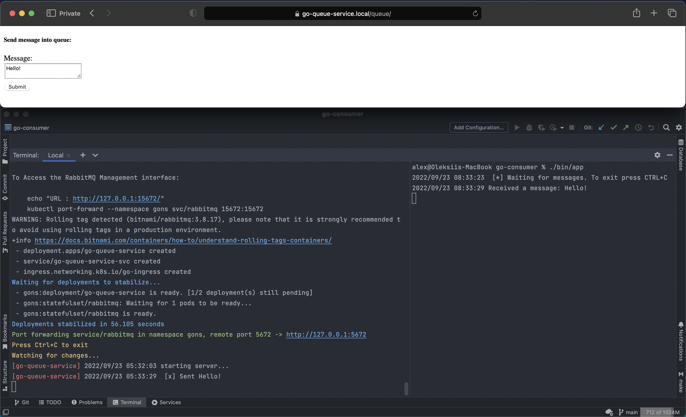

# go-consumer

### Consumer service handles messages from third-party channel.

⚠️ Third-party producer [go-queue-service](https://github.com/oleksiivelychko/go-queue-service) must be running before.

📌 Build binary and run consumer:
```
MQ_USER=rabbit MQ_PASS=secret MQ_HOST=go-queue-service.local MQ_PORT=5672 MQ_NAME=go-queue ./bin/app
```


